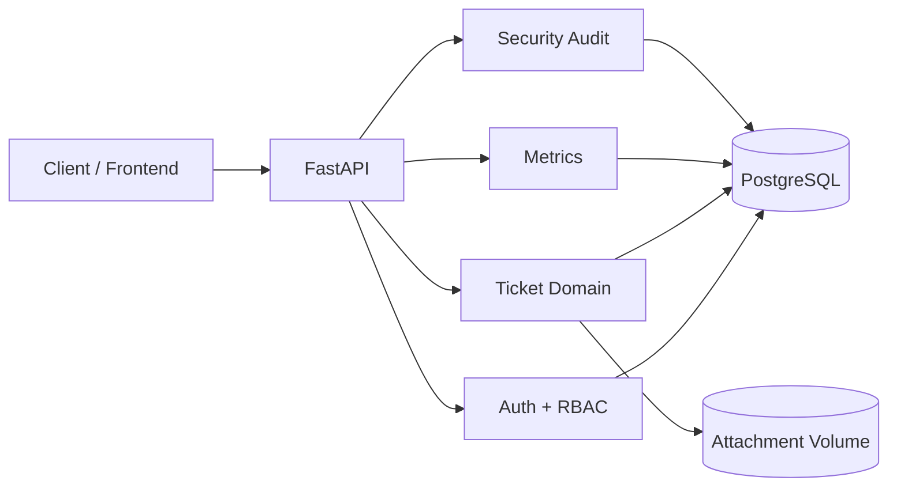

# SecureDesk

[](https://github.com/Jefferson21092008/SecureDesk/actions/workflows/ci.yml)

**SecureDesk** é uma API de service desk para gestão de chamados de TI, construída com foco em **backend, segurança, arquitetura, testes automatizados e observabilidade operacional**.

O projeto simula um sistema corporativo de atendimento com autenticação, controle de acesso por papel, histórico, anexos, SLA, auditoria de segurança e métricas para dashboard.

> Estado atual: backend concluído até a **v0.5.0**. A V1.0 está focada em documentação, frontend, integração e deploy.

## Destaques

- autenticação com JWT, expiração, `jti`, issuer/audience e revogação por sessão;
- RBAC com papéis `USER`, `AGENT` e `ADMIN`;
- proteção contra IDOR e mass assignment;
- tickets com status, prioridade, responsável, categoria, departamento e SLA;
- comentários, histórico de alterações e ciclo de vida de fechamento/reabertura;
- anexos com validação de tipo, tamanho e defesa contra path traversal;
- rate limiting global e proteção específica contra abuso de autenticação;
- audit log de segurança consultável por administradores;
- métricas de overview, SLA e breakdown com filtro por período;
- PostgreSQL + SQLAlchemy + Alembic;
- Docker Compose para ambiente local;
- suíte com **200+ testes automatizados** e CI no GitHub Actions;
- Swagger UI, ReDoc e OpenAPI organizados para exploração da API.

## Stack

| Camada | Tecnologia |
| --- | --- |
| API | FastAPI |
| ORM | SQLAlchemy 2 |
| Banco | PostgreSQL 17 |
| Migrações | Alembic |
| Validação | Pydantic |
| Autenticação | JWT + Argon2 |
| Testes | Pytest + HTTPX/TestClient |
| Qualidade | Ruff + compileall |
| Infra local | Docker + Docker Compose |
| CI | GitHub Actions |

## Arquitetura



A aplicação é organizada em rotas, schemas, modelos, serviços e infraestrutura. Regras sensíveis — como autorização, armazenamento de anexos, SLA, rate limiting e auditoria — ficam separadas dos handlers HTTP para reduzir acoplamento.

Veja a documentação detalhada em [`docs/ARCHITECTURE.md`](docs/ARCHITECTURE.md).

## Papéis e permissões

| Papel | Escopo principal |
| --- | --- |
| `USER` | cria e acompanha os próprios chamados |
| `AGENT` | atende chamados, realiza assignment e gerencia lifecycle |
| `ADMIN` | possui visão administrativa, incluindo gestão e auditoria de segurança |

Para usuários comuns, recursos de outros usuários são ocultados com comportamento consistente de `404` quando aplicável, reduzindo enumeração de IDs.

## Principais módulos da API

| Módulo | Exemplos |
| --- | --- |
| Authentication | cadastro, login e logout |
| Tickets | criação, consulta, atualização, filtros e exclusão |
| Assignment | atribuição de agente responsável |
| Lifecycle | fechamento e reabertura |
| Comments | comentários por chamado |
| History | histórico funcional do chamado |
| Attachments | upload, listagem, download e remoção |
| Categories | classificação por categoria |
| Departments | organização por departamento |
| Metrics | overview, SLA e breakdown |
| Security Audit | consulta de eventos de segurança por ADMIN |

A especificação navegável está disponível em `/docs`, `/redoc` e `/openapi.json` quando a aplicação está em execução.

## Executando com Docker

### 1. Clone o repositório

```bash
git clone https://github.com/Jefferson21092008/SecureDesk.git
cd SecureDesk
```

### 2. Crie o arquivo de ambiente

Linux/macOS:

```bash
cp .env.example .env
```

Windows CMD:

```cmd
copy .env.example .env
```

Os valores padrão servem apenas para desenvolvimento local. Antes de qualquer deploy, substitua credenciais e `JWT_SECRET`.

### 3. Suba os serviços

```bash
docker compose up --build -d
```

O container da API executa `alembic upgrade head` antes de iniciar o Uvicorn.

### 4. Acesse

- API: `http://localhost:8000/`
- Swagger UI: `http://localhost:8000/docs`
- ReDoc: `http://localhost:8000/redoc`
- Health check: `http://localhost:8000/health`

### 5. Valide o ambiente

```bash
docker compose exec api alembic current
docker compose exec api pytest -q
docker compose exec api ruff check .
```

O head atual das migrations é:

```text
0012_add_security_audit_logs
```

## Fluxo básico de uso

1. registre um usuário em `POST /auth/register`;
2. autentique em `POST /auth/login`;
3. use o Bearer token pelo botão **Authorize** do Swagger;
4. crie um chamado em `POST /tickets`;
5. acompanhe comentários, histórico, anexos, assignment e lifecycle conforme o papel do usuário;
6. consulte `/metrics/*` para dados de dashboard.

## Segurança

O SecureDesk aplica defesa em profundidade em várias camadas:

- hash de senha com Argon2;
- política de senha e validação estrita de entrada;
- access tokens JWT curtos e revogáveis;
- claims obrigatórios (`sub`, `jti`, `iat`, `exp`, `iss`, `aud`, `type`);
- RBAC e proteção contra IDOR;
- limitação de brute force e rate limiting;
- audit log de eventos relevantes;
- validação de conteúdo básico em uploads;
- proteção de paths de anexos;
- headers de segurança;
- safeguards para configuração de produção;
- testes de regressão contra cenários de abuso.

A documentação de segurança está em [`docs/SECURITY.md`](docs/SECURITY.md). A revisão técnica da fase V0.4 continua disponível em [`SECURITY_REVIEW.md`](SECURITY_REVIEW.md).

## Testes e CI

A suíte cobre regras funcionais e cenários de segurança, incluindo autenticação, autorização, IDOR, lifecycle, comentários, anexos, SLA, métricas, rate limiting, auditoria e JWT.

Execução local no container:

```bash
docker compose exec api pytest -q
docker compose exec api ruff check .
```

Ou, em um ambiente Python configurado:

```bash
python scripts/verify.py
```

O pipeline de CI executa:

```text
compileall
Ruff
Alembic upgrade head em PostgreSQL
Pytest
```

## Estrutura do repositório

```text
SecureDesk/
├── app/
│   ├── api/          # endpoints e dependências HTTP
│   ├── core/         # config, segurança, OpenAPI, validação e rate limit
│   ├── models/       # modelos SQLAlchemy
│   ├── schemas/      # contratos Pydantic
│   └── services/     # regras/serviços compartilhados
├── alembic/          # migrations
├── docs/             # arquitetura, segurança e histórico
├── tests/            # testes funcionais e de segurança
├── docker/           # imagem da API
├── scripts/          # verificação local
└── docker-compose.yml
```

## Documentação

- [`docs/ARCHITECTURE.md`](docs/ARCHITECTURE.md) — arquitetura, fluxo de requisição e decisões técnicas;
- [`docs/SECURITY.md`](docs/SECURITY.md) — controles, limites e checklist de produção;
- [`SECURITY_REVIEW.md`](SECURITY_REVIEW.md) — revisão de segurança da V0.4;
- [`docs/DEVELOPMENT_HISTORY.md`](docs/DEVELOPMENT_HISTORY.md) — histórico detalhado da evolução do projeto;
- `/docs` — documentação interativa Swagger;
- `/redoc` — referência ReDoc.

## Roadmap para 1.0

- [x] V1.0.1 — OpenAPI / Swagger
- [x] V1.0.2 — README, arquitetura e documentação de segurança
- [ ] V1.0.3 — frontend
- [ ] V1.0.4 — integração frontend/backend
- [ ] V1.0.5 — deploy
- [ ] V1.0.6 — polimento e release `v1.0.0`

## Objetivo do projeto

SecureDesk foi desenvolvido como projeto de estudo e portfólio para demonstrar competências de backend que vão além de CRUD: modelagem de domínio, segurança de API, autorização, migrations, testes, observabilidade, documentação e decisões arquiteturais com trade-offs explícitos.
