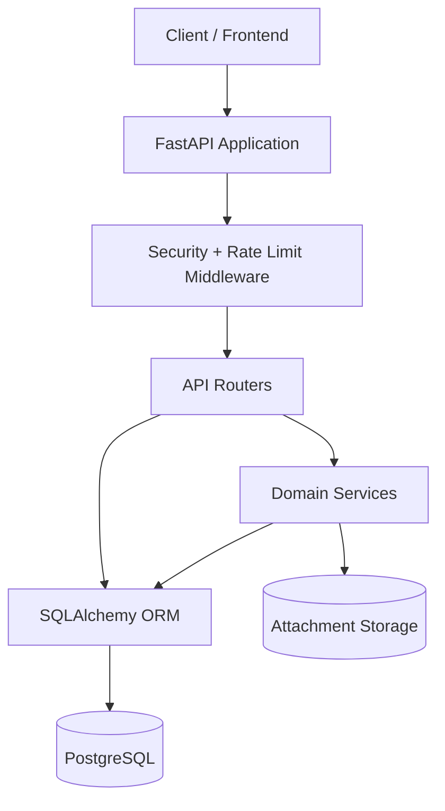
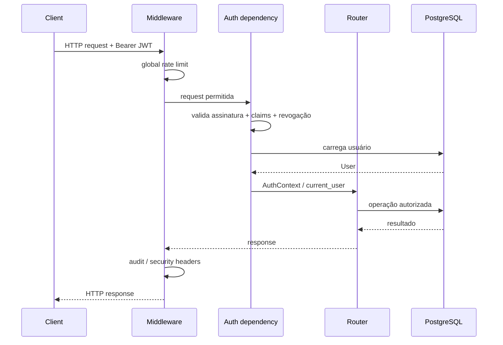
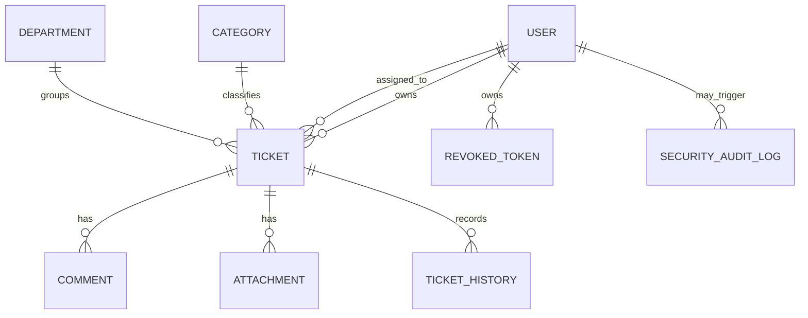

# SecureDesk — Architecture

Este documento descreve a arquitetura atual do backend do SecureDesk e as decisões técnicas relevantes para manutenção, entrevistas e evolução até a V1.0.

## Visão geral

O SecureDesk é uma API monolítica modular construída com FastAPI. O serviço HTTP, as regras de domínio e o acesso a dados vivem no mesmo deploy, mas são separados em módulos para reduzir acoplamento e permitir evolução futura.



## Organização por camadas

### `app/api`

Contém os endpoints HTTP e dependências de autorização. Essa camada interpreta requests, aplica dependências e transforma resultados em contratos Pydantic.

Módulos principais:

- `auth.py` — cadastro, login, logout e contexto autenticado;
- `tickets.py` — CRUD e consulta de chamados;
- `ticket_access.py` — regra central de acesso a tickets;
- `assignment.py` — atribuição de agente;
- `lifecycle.py` — fechamento e reabertura;
- `comments.py` — comentários;
- `history.py` — histórico funcional;
- `attachments.py` — upload/download/remoção;
- `categories.py` e `departments.py` — organização;
- `metrics.py` — agregações para dashboard;
- `security_audit.py` — consulta administrativa de eventos de segurança.

### `app/core`

Agrupa preocupações transversais:

- `config.py` — configurações e safeguards de produção;
- `security.py` — senha, JWT e validação do token;
- `validation.py` — regras compartilhadas de validação;
- `rate_limit.py` — rate limiting e controle de abuso em memória;
- `openapi.py` — metadados, tags e configuração da documentação.

### `app/models`

Modelos SQLAlchemy que representam o estado persistido:

- `User`;
- `Ticket`;
- `Comment`;
- `TicketHistory`;
- `Attachment`;
- `Category`;
- `Department`;
- `RevokedToken`;
- `SecurityAuditLog`.

### `app/schemas`

Contratos Pydantic separados dos modelos ORM. Isso evita expor diretamente entidades de persistência e ajuda a impedir mass assignment de campos controlados pelo servidor.

### `app/services`

Serviços compartilhados que encapsulam regras que não pertencem diretamente ao handler HTTP:

- armazenamento seguro de anexos;
- cálculo de SLA;
- gravação de eventos de auditoria.

## Fluxo de uma requisição autenticada



## Modelo de autorização

O sistema usa RBAC, mas o papel sozinho não é suficiente. Há também autorização por objeto.

- `USER` possui escopo restrito aos próprios chamados;
- `AGENT` e `ADMIN` possuem acesso transversal conforme a operação;
- recursos aninhados herdam o acesso ao ticket pai;
- `get_accessible_ticket` centraliza a proteção contra IDOR;
- rotas proibidas por papel negam acesso antes de consultar objetos quando isso reduz enumeração.

Esse desenho evita espalhar verificações inconsistentes de ownership por todos os endpoints.

## Domínio de tickets

O `Ticket` é a entidade central. Ele se relaciona com:



Campos importantes do ticket incluem status, prioridade, owner, agente responsável, categoria, departamento, `created_at`, `closed_at` e `sla_due_at`.

## Persistência e migrations

PostgreSQL é o banco principal. SQLAlchemy 2 é usado para queries e relacionamento das entidades, enquanto Alembic controla o schema.

A cadeia atual termina em:

```text
0012_add_security_audit_logs
```

No container da API, `alembic upgrade head` é executado antes do Uvicorn. Se a migration falhar, a API não inicia, evitando executar código contra um schema inesperado.

## Métricas

O módulo de métricas não carrega todos os tickets em memória para depois contar em Python. As agregações são delegadas ao banco.

Endpoints:

```text
GET /metrics/overview
GET /metrics/sla
GET /metrics/breakdown
```

Todos aceitam `date_from` e `date_to` e preservam o mesmo modelo de escopo:

- `USER` → `OWN`;
- `AGENT` / `ADMIN` → `GLOBAL`.

## Arquivos e anexos

Metadados ficam no PostgreSQL; bytes ficam em armazenamento local montado por volume no Docker.

Fluxo de upload:

1. valida tamanho permitido;
2. sanitiza o nome original;
3. valida extensão/MIME suportado;
4. faz validação básica dos bytes;
5. gera `storage_key` controlada pelo servidor;
6. grava bytes na área configurada;
7. persiste metadados no banco.

No download e cleanup, o caminho final é validado para permanecer dentro da raiz configurada.

Para um deploy de produção, a evolução natural é substituir o filesystem local por object storage privado.

## Rate limiting

O rate limiter atual é process-local e foi projetado para o container single-process atual. Há limites separados para:

- tráfego global da API;
- login;
- registro;
- falhas repetidas de autenticação.

Em múltiplos workers ou múltiplas réplicas, o backend do limiter deve migrar para armazenamento compartilhado, como Redis.

## Auditabilidade

Existem dois históricos independentes:

- `TicketHistory` — mudanças funcionais no chamado;
- `SecurityAuditLog` — autenticação, autorização e sinais de abuso.

Separar esses domínios evita transformar o histórico funcional em log de segurança e permite políticas diferentes de retenção no futuro.

## Decisões e trade-offs

### Monólito modular

Foi escolhido para manter o projeto simples de executar e demonstrar arquitetura sem introduzir complexidade artificial de microserviços.

### JWT com blacklist de `jti`

JWT mantém autenticação stateless na maioria das requisições, enquanto a blacklist permite logout/revogação por sessão. O custo é uma consulta para verificar revogação.

### Filesystem local para anexos

É simples e adequado ao ambiente atual, mas não é a escolha final para alta disponibilidade ou múltiplas réplicas.

### Rate limit em memória

Evita adicionar Redis antes de ele ser necessário, mas essa limitação está documentada e não deve ser ignorada em produção distribuída.

## Evolução prevista

Na V1.0, a arquitetura será complementada por:

1. frontend separado consumindo a API;
2. configuração de CORS baseada no ambiente de deploy;
3. deploy público com banco persistente;
4. observabilidade e logs adequados ao ambiente hospedado;
5. eventual backend compartilhado para rate limiting caso haja múltiplas instâncias.
