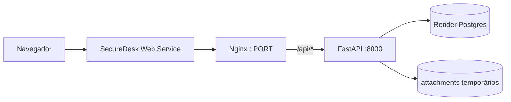

# Deploy do SecureDesk

A V1.0.5 inclui uma configuração de referência para publicar o SecureDesk no **Render** com infraestrutura como código (`render.yaml`). O objetivo é manter o mesmo desenho usado localmente: frontend Nginx, API FastAPI e PostgreSQL, sem liberar CORS desnecessariamente.

## Arquitetura publicada



O deploy de referência usa **um único Web Service** para o frontend e a API: o Nginx recebe o tráfego público e encaminha `/api/*` para o Uvicorn dentro do mesmo container. Isso mantém o mesmo origin do ambiente local, evita CORS e funciona sem depender de recebimento pela rede privada entre dois serviços gratuitos. O PostgreSQL continua como serviço gerenciado separado.

## 1. Pré-requisitos

- repositório atualizado no GitHub;
- conta no Render conectada ao GitHub;
- uma senha **nova e exclusiva** para o administrador inicial.

Não use `SecureDesk!2026` no ambiente público. Essa senha existe somente no seed local.

## 2. Criar o Blueprint

No Render:

1. escolha **New > Blueprint**;
2. conecte o repositório `SecureDesk`;
3. use o `render.yaml` da raiz;
4. selecione a branch que contém a V1.0.5;
5. informe `INITIAL_ADMIN_EMAIL` e `INITIAL_ADMIN_PASSWORD` quando o Render solicitar;
6. revise os recursos e execute **Deploy Blueprint**.

O Blueprint cria:

- `securedesk` — Web Service com Nginx + FastAPI no mesmo container;
- `securedesk-db` — PostgreSQL.

`JWT_SECRET` é gerado pela plataforma e não fica versionado no Git.

## 3. Inicialização

O container de produção executa, nessa ordem:

```text
renderiza a configuração do Nginx com $PORT
alembic upgrade head
python scripts/bootstrap_admin.py
uvicorn em 127.0.0.1:8000
Nginx em $PORT
```

O bootstrap é idempotente: cria o administrador somente quando necessário ou promove a conta informada para `ADMIN`. Ele nunca usa credenciais de demonstração.

Depois do primeiro deploy bem-sucedido, remova `INITIAL_ADMIN_PASSWORD` e `INITIAL_ADMIN_EMAIL` das variáveis do serviço se você não quiser manter essas credenciais disponíveis no ambiente. A conta já permanece persistida no banco.

## 4. Validar o deploy

Confirme:

- frontend abre sem erro;
- login do administrador funciona;
- `GET /health` da API retorna `{"status":"ok"}`;
- criação de chamado persiste após refresh;
- dashboard carrega métricas;
- página de auditoria aparece somente para `ADMIN`;
- logout invalida a sessão atual.

Swagger e ReDoc ficam disponíveis no mesmo domínio público, através do proxy `/api`:

```text
/api/docs
/api/redoc
/api/openapi.json
```

## 5. Banco e migrations

`DATABASE_URL` vem do Render Postgres. O SecureDesk normaliza URLs `postgresql://` para o driver SQLAlchemy `postgresql+psycopg://` usado pelo projeto.

A migration atual continua:

```text
0012_add_security_audit_logs
```

## 6. IP real e rate limiting

`TRUST_PROXY_HEADERS=true` é ativado pelo Blueprint porque a aplicação fica atrás da infraestrutura do Render. Fora de um proxy confiável, mantenha essa opção desabilitada para evitar spoofing de IP por headers enviados pelo cliente.

## 7. Anexos

A configuração gratuita de referência usa:

```text
/tmp/securedesk-attachments
```

Esse armazenamento é **efêmero**. Arquivos enviados podem desaparecer quando a instância é recriada ou redeployada. Para um ambiente durável, use um disco persistente compatível com o provedor ou mova anexos para object storage (S3/R2/compatível).

## 8. Limitações da configuração gratuita

A configuração `render.yaml` prioriza demonstração de portfólio e baixo custo. Recursos gratuitos podem dormir, ter limites de uso e possuir políticas de retenção diferentes das camadas pagas. Antes de usar o sistema como serviço real, revise o plano do banco, persistência de anexos, backups, disponibilidade e escalabilidade.

O rate limiter atual continua em memória e foi projetado para uma única instância da API. Para múltiplas réplicas, migre o estado do limiter para Redis/Key Value antes de escalar horizontalmente.

## 9. Checklist antes de divulgar

- trocar/remover qualquer credencial temporária;
- não executar `scripts/seed_demo.py` em produção;
- confirmar `APP_ENV=production` e `DEBUG=false`;
- confirmar que o `JWT_SECRET` não está no repositório;
- testar login/logout e papéis;
- validar health checks;
- verificar logs de deploy;
- testar a URL pública em janela anônima;
- adicionar a URL pública ao README somente depois de o deploy estar estável.
